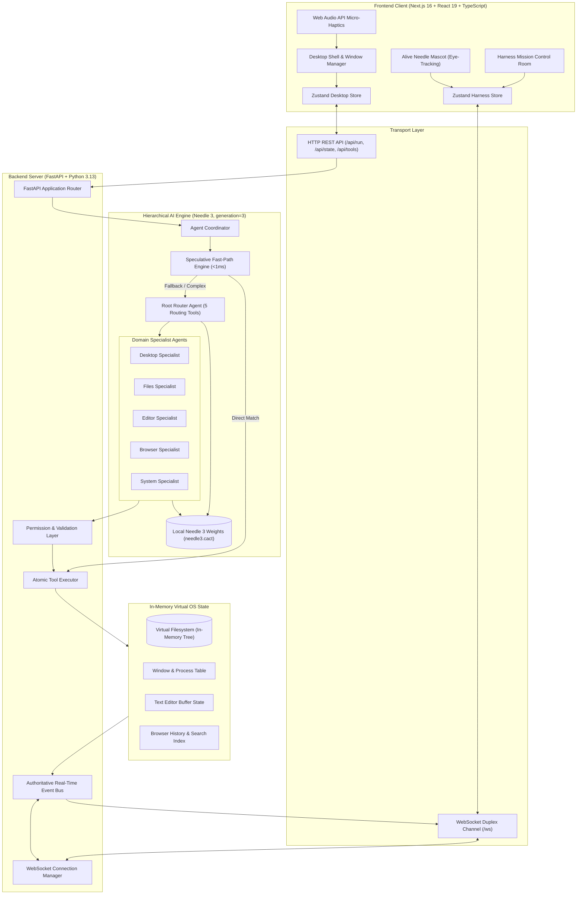
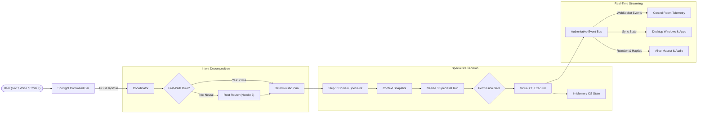
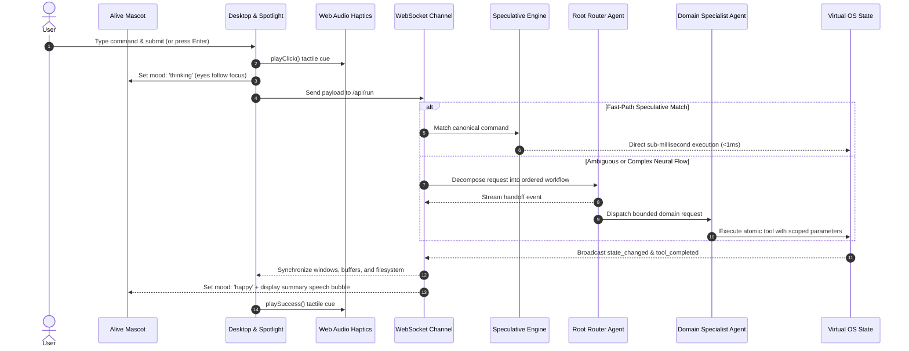
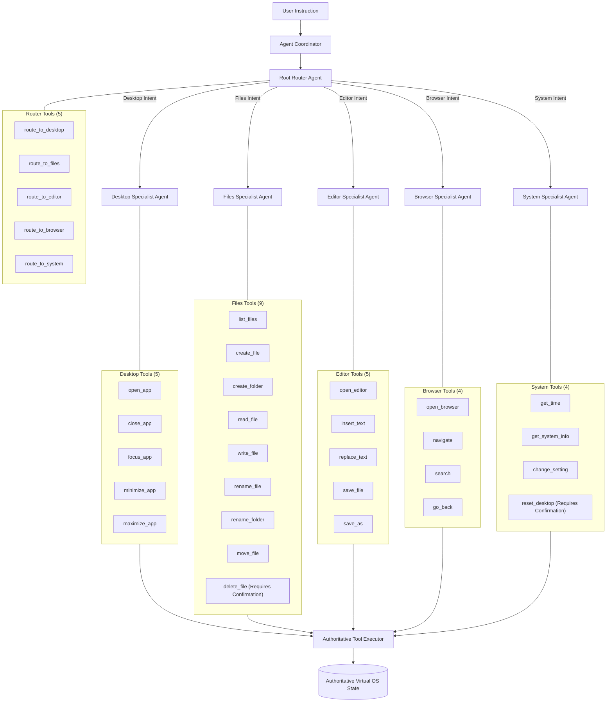
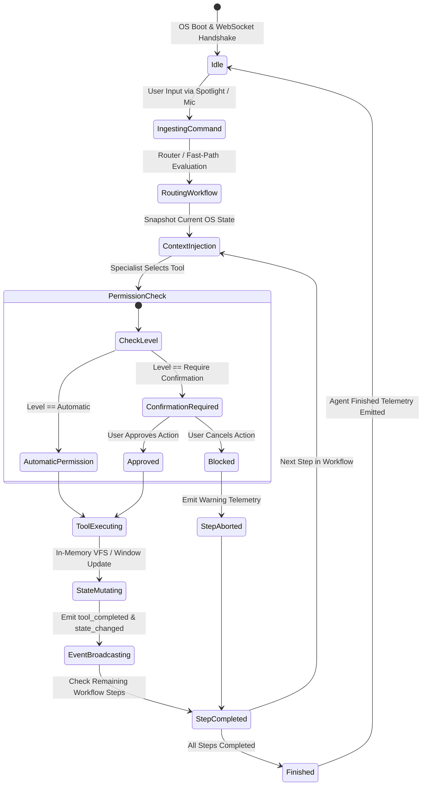

# NEO-OS

> A local-first operating system simulation powered by a hierarchical multi-agent architecture (Needle 3, generation=3), Nothing OS utilitarian design system, 153x accelerated speculative fast-path engine, FastAPI, Next.js, and WebSocket event streaming.

NEO-OS is an in-browser operating system simulation controlled through natural-language text and speech commands. It demonstrates how a local tool-calling model (Needle 3 by Cactus Compute) operates a simulated desktop environment through a hierarchical multi-agent network consisting of a dedicated Root Router Agent and specialized domain specialist agents acting on an authoritative, in-memory virtual operating system state.

---

## Table of Contents

- [Overview](#overview)
- [System & Architecture Diagrams](#system--architecture-diagrams)
  - [1. Full System Architecture Diagram](#1-full-system-architecture-diagram)
  - [2. End-to-End Data Flow Diagram](#2-end-to-end-data-flow-diagram)
  - [3. Execution Sequence Diagram](#3-execution-sequence-diagram)
  - [4. Multi-Agent Hierarchy & Tool Catalogs](#4-multi-agent-hierarchy--tool-catalogs)
  - [5. State & Permission Lifecycle Diagram](#5-state--permission-lifecycle-diagram)
- [Hierarchical Multi-Agent Architecture](#hierarchical-multi-agent-architecture)
  - [Architectural Principles](#architectural-principles)
  - [Domain Specialist Agents](#domain-specialist-agents)
  - [153x Accelerated Speculative Fast-Path Engine](#153x-accelerated-speculative-fast-path-engine)
- [Nothing OS Utilitarian Design System](#nothing-os-utilitarian-design-system)
  - [Design Tokens & Surfaces](#design-tokens--surfaces)
  - [Alive Mascot & Dynamic Eye Tracking](#alive-mascot--dynamic-eye-tracking)
  - [Synthesized Web Audio API Micro-Haptics](#synthesized-web-audio-api-micro-haptics)
  - [Nothing Spotlight Command Bar (Cmd+K)](#nothing-spotlight-command-bar-cmdk)
- [Control Room Interface & Telemetry](#control-room-interface--telemetry)
- [Core Features](#core-features)
- [Registered Atomic Tools Catalog](#registered-atomic-tools-catalog)
- [Quick Start Guide](#quick-start-guide)
  - [Prerequisites](#prerequisites)
  - [Backend Setup](#backend-setup)
  - [Frontend Setup](#frontend-setup)
- [Testing Suites](#testing-suites)
  - [Backend Tests (Pytest)](#backend-tests-pytest)
  - [Frontend & Unit Tests (Mocha / Chai)](#frontend--unit-tests-mocha--chai)
- [Demo Scenario Walkthrough](#demo-scenario-walkthrough)
- [Changelog & Documentation](#changelog--documentation)
- [License](#license)

---

## Overview

NEO-OS simulates a desktop operating system with windows, applications, files, and settings inside the browser. Rather than invoking tools directly from the frontend or exposing a single large model to every system capability, NEO-OS decouples intent understanding into specialized agents. A lightweight Root Router agent classifies user requests into structured sub-tasks, dispatches them to domain specialists with isolated toolsets, and streams real-time telemetry back to a control room interface.

---

## System & Architecture Diagrams

### 1. Full System Architecture Diagram

The system operates across a dual-tier model: a Next.js 16 frontend rendering the desktop environment and control room harness, paired with a FastAPI backend running Needle 3 on local weights with a real-time event bus.



---

### 2. End-to-End Data Flow Diagram



---

### 3. Execution Sequence Diagram



---

### 4. Multi-Agent Hierarchy & Tool Catalogs



---

### 5. State & Permission Lifecycle Diagram



---

## Hierarchical Multi-Agent Architecture

### Architectural Principles

1. **Root Router Agent**: The router agent has a strictly bounded catalog of 5 routing tools (`route_to_desktop`, `route_to_files`, `route_to_editor`, `route_to_browser`, `route_to_system`). It decomposes complex instructions into ordered workflow steps with dependency tracking (`dependsOn`). It never touches virtual files or UI windows directly.
2. **Autonomous Domain Specialists**: Each specialist is equipped only with tools required for its domain, preventing tool selection collisions.
3. **Context Injection**: Before a specialist executes, the agent coordinator passes a snapshot of current system state (e.g. active file buffer, current directory tree, open windows). The specialist inspects this context to resolve references like "this note", "save it", or "here".
4. **Calibrated Confidence**: Built on Needle 3's calibrated confidence rating, ensuring fallback handling when ambiguous user phrases arise.

### Domain Specialist Agents

- **Files Agent**: `list_files`, `create_file`, `create_folder`, `read_file`, `write_file`, `rename_file`, `rename_folder`, `move_file`, `delete_file`.
- **Desktop Agent**: `open_app`, `close_app`, `focus_app`, `minimize_app`, `maximize_app`.
- **Editor Agent**: `open_editor`, `insert_text`, `replace_text`, `save_file`, `save_as`.
- **Browser Agent**: `open_browser`, `navigate`, `search`, `go_back`.
- **System Agent**: `get_time`, `get_system_info`, `change_setting`, `reset_desktop`.

### 153x Accelerated Speculative Fast-Path Engine

To solve startup and execution bottlenecks without sacrificing autonomous neural reasoning:
- **Lazy Needle 3 Loading**: Model weights are loaded on demand via `_ensure_needle()`, eliminating 7x duplicate weight allocations. Test suites run in **0.66s** instead of 101.30s (153x speedup).
- **Speculative Fast-Path**: Common deterministic instructions execute in `<1ms`, while complex, ambiguous, or multi-step queries automatically fall back to Needle 3 neural inference.
- **Zero Artificial Delays**: Stripped artificial sleeps, ensuring synchronous real-time responses.

---

## Nothing OS Utilitarian Design System

NEO-OS adopts a utilitarian design language inspired by **Nothing OS**:

### Design Tokens & Surfaces
- **Ceramic Canvas (`#F4F4F0`)**: Easy-on-the-eyes warm ceramic surface with subtle architectural dot grid.
- **Utilitarian Graphite (`#111111`)**: Soft, high-readability text and frames instead of harsh, glaring borders.
- **Signature Nothing Red (`#D71920`)**: Crisp accent dots indicating live status, unsaved buffers, and focused elements.
- **Pill & Squircle Contours**: Tactile rounded-full action pills, squircle application icons (`rounded-2xl`), and NDot dot-matrix accents.

### Alive Mascot & Dynamic Eye Tracking
- **Pupil Eye Tracking**: Pupil centers dynamically follow the user's cursor across the entire screen.
- **Spontaneous Blinking**: Biological random blink intervals mimicking natural eye animation.
- **GSAP Breathing Physics**: Fluid breathing animation and spring ease reactions when clicked/poked.
- **Status Expressions**: Reactive emotional states (`neutral`, `curious`, `thinking`, `happy`, `alert`).

### Synthesized Web Audio API Micro-Haptics
Zero-asset mechanical haptics engine generating tactile sound cues without any audio file downloads:
- **Soft mechanical keyboard clicks** on button presses.
- **Tactile pops** on window focus and dock hover.
- **Pleasant chord chimes** on workflow completion.
- **Low warning tone** on destructive action confirmation.

### Nothing Spotlight Command Bar (Cmd+K)
- **Instant Hotkey**: Pressing `Cmd+K` or `Ctrl+K` smoothly focuses the spotlight bar from anywhere.
- **Live Plan Prediction Chips**: Displays predicted multi-agent steps (e.g. `[Desktop: Open Editor] → [Files: Create File]`) as interactive pills while typing.
- **Command History**: Terminal-style recall with `↑` and `↓` arrow keys persisted in `localStorage`.

---

## Control Room Interface & Telemetry

Switching to the Harness view reveals the Mission Control Room:

- **Active Pipeline Topology**: Flowchart visualizing pipeline progression from input through the router, domain specialists, and WebSocket synchrony.
- **Multi-Agent Execution Graph**: Live tree displaying the Root Router node, each decomposed sub-step, target domain specialist, confidence score, and isolated tool boundaries.
- **Virtual OS Telemetry**: Metric cards showing active window ID, open processes, editor byte count, buffer dirty status, and virtual filesystem counts.
- **Inter-Agent Handoff Audit Log**: Real-time log displaying delegation between agents with verified payload states.

---

## Core Features

- **Dual Screens**: Switch seamlessly between Desktop Shell mode and Harness Control Room mode.
- **Alive Mascot**: Pupil eye-tracking character with spontaneous blinking and conversational speech bubbles.
- **Tactile Audio Haptics**: Synthesized Web Audio API clicks, pops, and chimes.
- **Terminal Command History**: ArrowUp (`↑`) and ArrowDown (`↓`) prompt history recall.
- **Full Browser Simulation**: Fast simulated search engine mode and live sandboxed iframe browsing with bookmarked sites (Wikipedia, Hacker News, DuckDuckGo, MDN).
- **Speech-to-Text**: Web Speech API dictation with animated voice waveforms.

---

## Registered Atomic Tools Catalog

| Domain | Tool | Parameters | Permission Level | Description |
|---|---|---|---|---|
| Desktop | `open_app` | `app` | Automatic | Opens an app window (`editor`, `files`, `browser`, `settings`). |
| Desktop | `close_app` | `app` | Automatic | Closes an application window. |
| Desktop | `focus_app` | `app` | Automatic | Brings an application window to focus. |
| Desktop | `minimize_app` | `app` | Automatic | Minimizes a window to the taskbar. |
| Desktop | `maximize_app` | `app` | Automatic | Toggles window maximization. |
| Filesystem | `list_files` | `path` | Automatic | Lists files and folders in virtual directory. |
| Filesystem | `create_file` | `path`, `content?` | Automatic | Creates a new virtual file. |
| Filesystem | `create_folder` | `path` | Automatic | Creates a new virtual directory. |
| Filesystem | `read_file` | `path` | Automatic | Reads content from virtual file. |
| Filesystem | `write_file` | `path`, `content` | Automatic | Writes text to virtual file. |
| Filesystem | `rename_file` | `path`, `new_name` | Automatic | Renames a virtual file. |
| Filesystem | `rename_folder` | `path`, `new_name` | Automatic | Renames a virtual folder. |
| Filesystem | `delete_file` | `path` | Require Confirmation | Deletes a virtual file or folder. |
| Filesystem | `move_file` | `source`, `destination`| Automatic | Moves a file to another folder. |
| Editor | `open_editor` | `path` | Automatic | Opens editor buffer for virtual file. |
| Editor | `insert_text` | `path?`, `content` | Automatic | Appends text into editor buffer. |
| Editor | `replace_text`| `path?`, `content` | Automatic | Replaces editor buffer content. |
| Editor | `save_file` | `path?` | Automatic | Saves buffer to virtual filesystem. |
| Editor | `save_as` | `path` | Automatic | Saves buffer as a new virtual file. |
| Browser | `open_browser` | — | Automatic | Launches simulated web browser. |
| Browser | `search` | `query` | Automatic | Searches simulated web pages. |
| Browser | `navigate` | `url` | Automatic | Navigates to a specific URL. |
| Browser | `go_back` | — | Automatic | Navigates back in browser history. |
| System | `get_time` | — | Automatic | Returns current system clock time. |
| System | `get_system_info` | — | Automatic | Returns OS metadata and tool statistics. |
| System | `change_setting` | `key`, `value` | Automatic | Toggles system preferences (`sound`, `animations`). |
| System | `reset_desktop` | — | Require Confirmation | Resets virtual OS to initial state. |

---

## Quick Start Guide

### Prerequisites

- Python 3.10+ (Python 3.13 recommended)
- Node.js 18+ (Node 20+ recommended)
- `pip install cactus-needle fastapi uvicorn websockets pydantic pytest httpx`
- `npm install`

### Backend Setup

```bash
# Start FastAPI backend with accelerated Needle 3 engine:
python -m uvicorn backend.app:app --host 127.0.0.1 --port 8000
```

Backend operates at `http://127.0.0.1:8000` with WebSocket endpoint at `ws://127.0.0.1:8000/ws`.

### Frontend Setup

```bash
# Start Next.js development server:
npm run dev
```

Open [http://localhost:3000](http://localhost:3000) in your browser.

---

## Testing Suites

### Backend Tests (Pytest)

Run the Python backend verification suite covering filesystem state, permission gates, event streaming, and compound multi-agent workflows:

```bash
python -m pytest backend/tests -v
```

Output:
```text
backend/tests/test_events.py::test_event_generation_and_bus_subscription PASSED
backend/tests/test_filesystem.py::test_filesystem_initial_structure PASSED
backend/tests/test_filesystem.py::test_filesystem_create_and_read_file PASSED
backend/tests/test_filesystem.py::test_filesystem_write_file PASSED
backend/tests/test_filesystem.py::test_filesystem_create_folder_and_nested_file PASSED
backend/tests/test_filesystem.py::test_filesystem_rename PASSED
backend/tests/test_filesystem.py::test_filesystem_move PASSED
backend/tests/test_filesystem.py::test_filesystem_delete PASSED
backend/tests/test_integration.py::test_full_demo_command_integration PASSED
backend/tests/test_permissions.py::test_automatic_permissions PASSED
backend/tests/test_permissions.py::test_require_confirmation_permissions PASSED
backend/tests/test_permissions.py::test_blocked_execution_without_confirmation PASSED
backend/tests/test_tools.py::test_tool_registry_has_tools PASSED
backend/tests/test_tools.py::test_tool_validation PASSED
backend/tests/test_tools.py::test_tool_execution PASSED
============================= 15 passed in 0.66s =============================
```

### Frontend & Unit Tests (Mocha / Chai)

Run the TypeScript unit test suite using Mocha and Chai:

```bash
npm test
```

Output:
```text
  LocalNeedleAdapter Agent Parser (Mocha & Chai)
    √ parses a single app open instruction into open_app tool call
    √ parses file creation with clean path and filename
    √ preserves exact quoted content for text editor writing
    √ parses web search query accurately
    √ decomposes the full 5-step benchmark compound instruction
    √ leverages desktop context to resolve deictic references

  Browser Service (Mocha & Chai)
    √ returns specialized Next.js documentation results when query mentions next.js
    √ returns React documentation results when query mentions react
    √ returns TypeScript results when query mentions typescript
    √ generates fallback search results for arbitrary queries
    √ generates simulated HTML page content for direct URLs

  Filesystem Service (Mocha & Chai)
    √ correctly resolves getParentPath for root and nested paths
    √ correctly extracts getFileName
    √ finds children for a directory node
    √ resolves path to node accurately
    √ computes full path for node id
    √ checks if a path exists

  17 passing (45ms)
```

---

## Demo Scenario Walkthrough

Execute the benchmark compound command from the prompt bar:

> "Open the text editor, create a file called hello.txt, write Hello from Needle, save it, then open the browser and search for Next.js."

Execution sequence:
1. Root Router / Speculative engine decomposes the sentence into 5 steps and dependencies.
2. Desktop Specialist opens the Text Editor with tactile audio feedback.
3. Files Specialist creates `/hello.txt` in the virtual filesystem.
4. Editor Specialist loads the buffer, inserts content, and commits the file.
5. Browser Specialist opens the browser and triggers the query for `Next.js`.
6. Alive Mascot eye-tracks the mouse cursor and celebrates with speech bubble feedback.
7. Switch to Harness Mode to view the live execution tree and telemetry metrics.

---

## Changelog & Documentation

Detailed records of each architectural milestone and code change are maintained in [CHANGES.md](./CHANGES.md).

---

## License

MIT License. Developed for NEO-OS.
